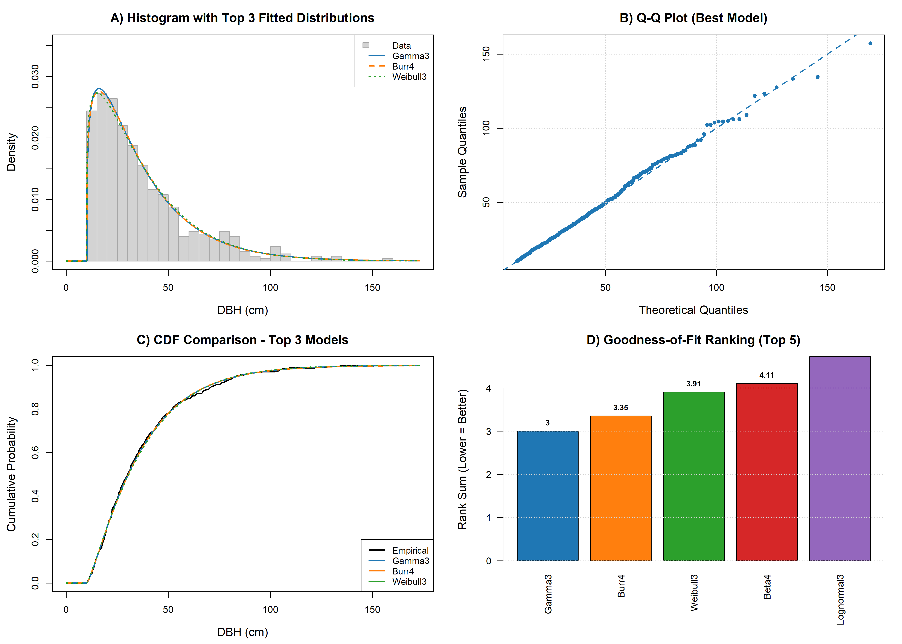

# Forest Diameter Distribution Modelling


## Overview

An R pipeline that fits twelve candidate probability distributions to tree
diameter at breast height (DBH) data by maximum likelihood, ranks them with
Kolmogorov–Smirnov, Anderson–Darling and Cramér–von Mises statistics, and
produces diagnostic plots and parameter tables. It is the first repository in a
portfolio that moves from forest biometrics in R towards geospatial application
development.

## Objectives

* Describe a DBH sample with a diameter-class frequency table.
* Fit 2-, 3- and 4-parameter candidate distributions (Beta, Burr, Gamma,
  Log-Gamma, Log-logistic, Lognormal, Weibull) to the same data.
* Compare the candidates with goodness-of-fit statistics and AIC, and rank them.
* Export reproducible tables and publication-resolution figures.

## Study Area / Dataset

The repository ships a **synthetic** DBH sample (500 trees, one column,
`Dbh(cm)`) so that the pipeline runs end to end without any field data. It
represents no real stand and has no study area. To analyse real inventory data,
supply your own CSV in the same format (see [Usage](#usage)). No GIS data are used.

## Technologies

* R (>= 4.0)
* [`fitdistrplus`](https://cran.r-project.org/package=fitdistrplus) for the
  2-parameter maximum-likelihood fits
* [`goftest`](https://cran.r-project.org/package=goftest) for the Cramér–von Mises statistic
* Base R (`optim`, `ks.test`, graphics devices) for everything else

## Methodology

DBH values are cleaned, tabulated into diameter classes, and used to fit twelve
distributions. 2-parameter Gamma, Lognormal and Weibull models use
`fitdistrplus`; the other models are fitted with a bounded L-BFGS-B
maximisation of the log-likelihood. Each fit is scored with KS, AD and CvM
statistics, log-likelihood and AIC, and models are ranked by the sum of their
relative ranks on the three statistics. Full details, parameter bounds and a log
of corrections are in [`docs/methodology.md`](docs/methodology.md).

## Workflow

```
dbh_sample.csv ─► 01 cleaning ─► 02 diameter classes ─► 03 distribution fitting
                                                              │
                         05 visualisation ◄─ 04 goodness of fit & ranking
```

| Step | Script | Main output |
|---|---|---|
| 1 | `R/01_data_cleaning.R` | cleaned `data` vector, summary values |
| 2 | `R/02_diameter_classes.R` | `outputs/tables/diameter_class_table.csv` |
| 3 | `R/03_distribution_fitting.R` | `fits` (parameter estimates for 12 models) |
| 4 | `R/04_goodness_of_fit.R` | `goodness_of_fit_results.csv`, `parameters_long_format.csv`, `parameters_wide_format.csv` |
| 5 | `R/05_visualization.R` | six PNG figures in `outputs/figures/` |

## Results

Running `Rscript run_all.R` writes the ranked goodness-of-fit table
(`outputs/tables/goodness_of_fit_results.csv`) and the fitted parameters
(`outputs/tables/parameters_*_format.csv`). The best-ranked model is the first
row of the goodness-of-fit table and is also printed in the final summary.
Results obtained on the bundled synthetic sample demonstrate that the pipeline
works; they are not findings about any forest.

## Example Outputs

Generated by `Rscript run_all.R` (commit the files in `outputs/` to display them here):

| File | Content |
|---|---|
| `outputs/figures/histogram_all_models.png` | Histogram with all fitted densities |
| `outputs/figures/histogram_top3_models.png` | Histogram with the three best-ranked densities |
| `outputs/figures/qq_plot_best_model.png` | Q-Q plot of the best-ranked model |
| `outputs/figures/cdf_comparison_top3.png` | Empirical vs fitted CDFs, top three models |
| `outputs/figures/combined_diagnostic_plots.png` | 2 × 2 diagnostic panel |
| `outputs/figures/histogram_weibull2_gamma2.png` | Histogram with 2-parameter Weibull and Gamma fits |



## Accuracy / Validation

Fit quality is assessed on the estimation data with the KS, AD and CvM
statistics, log-likelihood and AIC (`goodness_of_fit_results.csv`), and
visually with the Q-Q plot, CDF comparison and histogram overlays. No p-values
are reported and there is no hold-out or cross-validation step: the statistics
rank candidates against each other and are not formal tests of the chosen model.

## Installation

```bash
git clone <repository-url>
cd 01-forest-diameter-distribution-modelling
Rscript -e 'install.packages(c("fitdistrplus", "goftest"))'
```

`R/01_data_cleaning.R` also installs the two packages if they are missing. The
pipeline was tested with R 4.3.3, fitdistrplus 1.1.11 and goftest 1.2.3.

## Usage

Run all commands from the repository root.

```bash
# 1. (Re)generate the synthetic sample (optional, already included)
Rscript scripts/make_sample_data.R

# 2. Run the full pipeline
Rscript run_all.R

# Use your own DBH file (single column, header "Dbh(cm)")
DBH_CSV=path/to/your_dbh.csv Rscript run_all.R
```

In an R session (any operating system, including Windows):

```r
Sys.setenv(DBH_CSV = "path/to/your_dbh.csv")
source("run_all.R")
```

Optional environment variables: `DBH_CSV` (input file), `OUT_FIG_DIR` and
`OUT_TAB_DIR` (output folders), `DBH_CLASS_WIDTH` (class width in cm, default 10).
Scripts can also be sourced one by one in an R session, in numerical order.

## Project Structure

```
01-forest-diameter-distribution-modelling/
├── R/
│   ├── 01_data_cleaning.R
│   ├── 02_diameter_classes.R
│   ├── 03_distribution_fitting.R
│   ├── 04_goodness_of_fit.R
│   └── 05_visualization.R
├── data/
│   ├── raw/dbh_sample.csv          # synthetic
│   └── README.md
├── docs/methodology.md
├── outputs/
│   ├── figures/
│   ├── models/
│   └── tables/
├── scripts/make_sample_data.R
├── run_all.R
├── DESCRIPTION                     # package dependencies
├── LICENSE
└── README.md
```

## Data Provenance

`data/raw/dbh_sample.csv` is **synthetic**. It was generated by
`scripts/make_sample_data.R` (seed 2026): a shifted Weibull body above a 10 cm
threshold plus about 6% large trees from a lognormal distribution, rounded to
0.1 cm. It is not field data. See [`data/README.md`](data/README.md).

## Limitations

* Goodness-of-fit statistics are computed on the data used for estimation; no
  p-values or out-of-sample validation are provided.
* Several location parameters, and some Beta4 parameters, can sit on their
  optimisation bounds, particularly for data truncated at an inventory threshold.
* The ranking depends on the set of candidate models and on the bounds and
  starting values chosen in `R/03_distribution_fitting.R`.
* The bundled data are simulated; results on them say nothing about real stands.
* `outputs/models/` is reserved and currently empty: fitted models are not saved to disk.

## Future Improvements

* Add a Johnson SB candidate (not part of the current model set).
* Add out-of-sample validation or bootstrap uncertainty for the parameter estimates.
* Save fitted model objects to `outputs/models/`.

## Author

Oyediran Abiodun — forest biometrics and geospatial data analysis.

## License

Released under the [MIT License](LICENSE).
